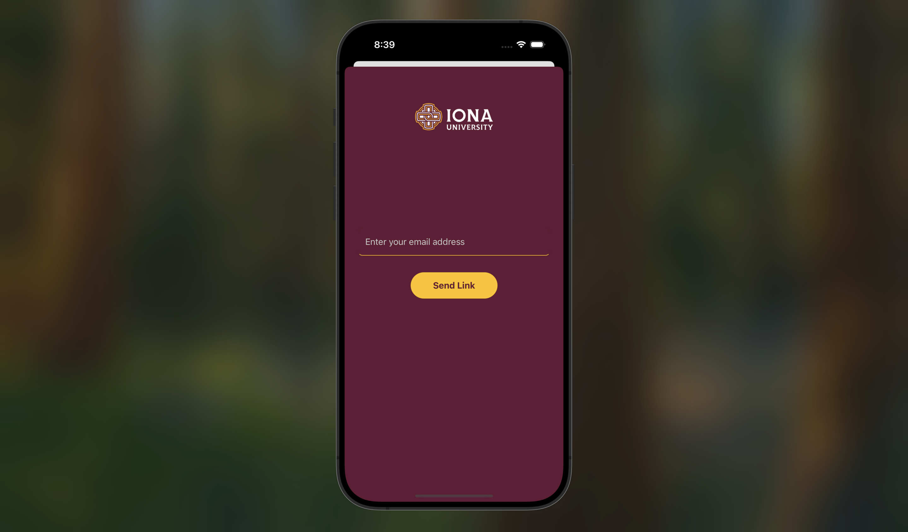
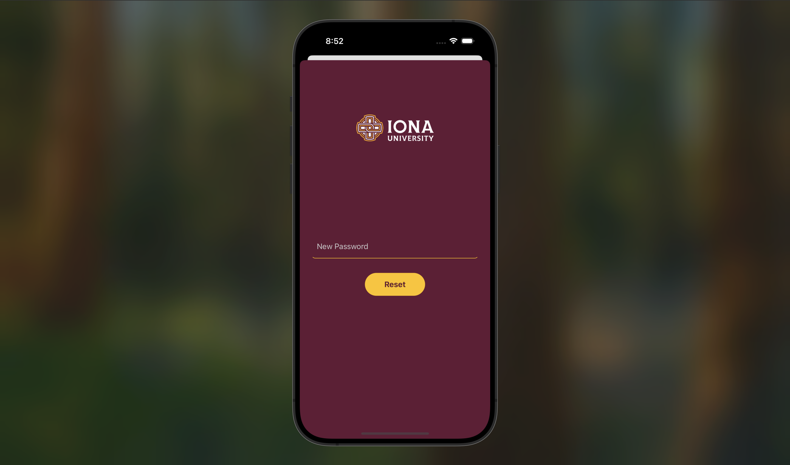
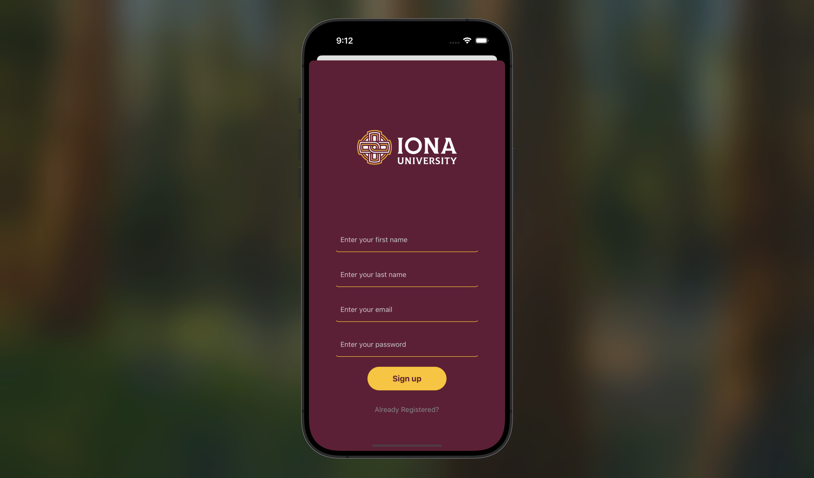
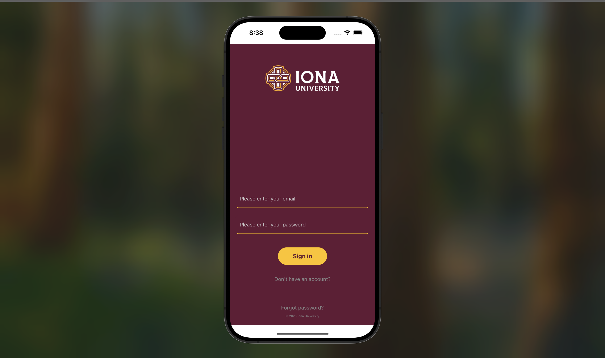
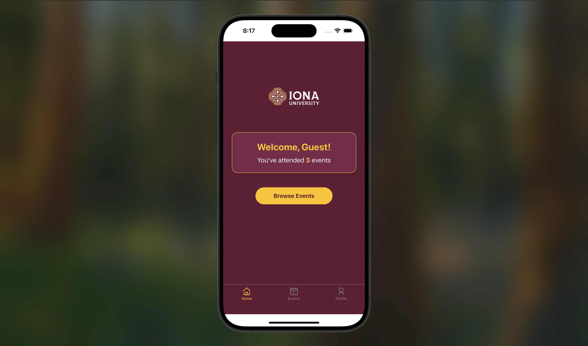
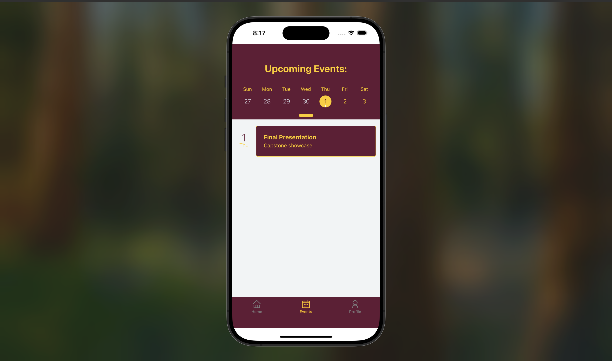
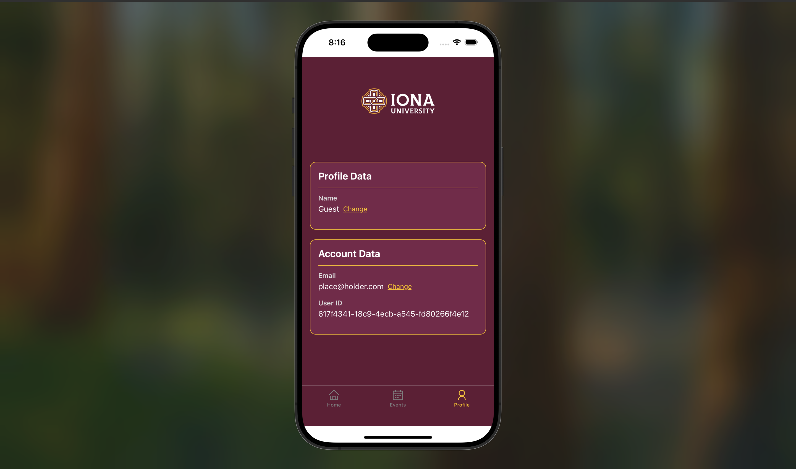
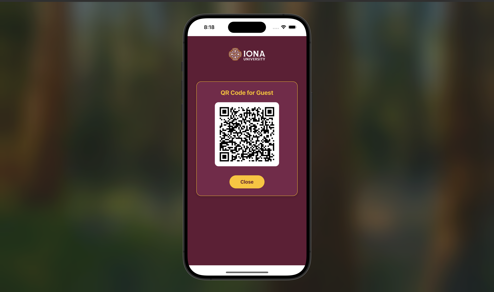

# ENT Login App (Demo Version)

ENT Login is a mobile app built with React Native (Expo) and Supabase to streamline event attendance tracking for Iona University’s Entrepreneurship Department.  
This is a demo version intended to showcase core functionality; not all features are fully implemented yet.

---

## Features (Implemented)

- Email OTP verification using Supabase Auth
- Role detection based on email domain (`@gaels.iona.edu`, `@iona.edu`, others)
- Sign-up and profile completion with first name, last name, and password
- Interactive event calendar using Agenda
- QR Code generation for event check-in
- UI with Iona-branded maroon and gold theme
- Organized navigation using expo-router
- User data persisted via Supabase database

---

## Planned Enhancements

- Dynamic event database connection (currently hardcoded sample events)
- Role-based access control refinement
- Email templates for better user communication
- Further UI/UX improvements
- Real-time QR code check-in backend validation

---

## Screenshots

| Email Verification | Reset Password | Sign Up | Log In |
|:------------------:|:--------------:|:------:|:-----:|
|  |  |  |  |

| Home | Events | Profile | QR Code |
|:----:|:------:|:-------:|:------:|
|  |  |  |  |

---

## Tech Stack

- React Native (Expo)
- Supabase – Auth and Database
- JavaScript
- react-native-calendars – Agenda component
- react-native-qrcode-svg – QR Code generation
- expo-router – File-based navigation
- AsyncStorage – Temporary data handling
- Custom fonts (optional)

---

## Installation

```bash
git clone https://github.com/Jfly2/ent-login.git
cd ent-login
npm install
npx expo start
